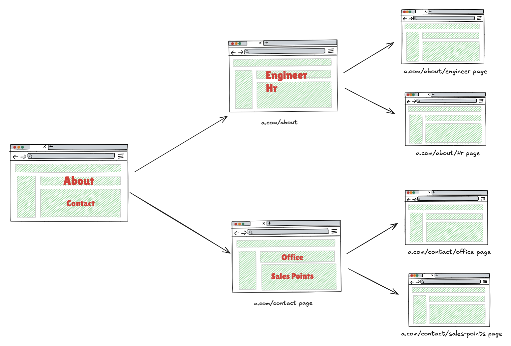

# Web Crawler 

Build a web crawler that takes a URL as input and finds all unique pages for the given website.

## Current Design

+ **Visited URL Tracking** 

  The crawler keeps a set of all URLs it has already visited. Before opening a new page, it checks this set.  
+ **Robust Error Handling** 

  The crawler gracefully handles issues like broken links, timeouts, or unsupported formats by logging errors and continuing with the remaining URLs without crashing.
+ **Swagger UI** 

  FastAPI automatically serves interactive docs at /docs (Swagger UI) http://localhost:8000/docs.
+ **BFS Travel Strategy** 

  Explores pages level by level, ensuring that closer (linked) pages are visited before going deeper. This helps avoid getting stuck in deep or infinite link paths early.
+ **URL Normalization**  
  Some URLs look different but actually point to the same content. The crawler cleans and standardizes each URL before saving it.

+ **URL Validation**
  
  Check if a given URL is valid and well-formed

## Future Improvements
  + **Politeness** 
  
    A crawler that sends too many requests too quickly can unintentionally behave like a DDoS (Distributed Denial of Service) attacker.
    + **Respect robots.txt** file to indicate which parts of the site crawlers can or cannot access.
+ **Maximum Crawl Depth** 
  
    Limit how deep the crawler can go from the starting page. For example, stop after 3 levels of links.
+ **Page Limit**

  Stop the crawl after visiting a certain number of pages (e.g., 500).  
  This protects both the crawler and the website from unnecessary load.  
      It prevents:
    - Overloading your own system
    - Risk of being flagged as abusive

+ **Retry mechanism**
  
    Some errors are temporary — retrying may help. The crawler can be extended to:
  - Retry failed requests (e.g., 2–3 times)
  - Add a short delay between attempts
  - Skip the link if all retries fail

+ **Custom URL validation**

    To avoid wasting requests on unsupported or broken links, the URL validation function can be extended to reject;

    - mailto:, javascript:, tel: — not real web pages
    - (If Applicable) Static files like .css, .jpg, .pdf, etc.
  
    Why This Matters:

  - Saves bandwidth
  - Reduces errors
  - Focuses the crawl on actual HTML pages

+ **Metrics and Reporting**

    Tracking metrics helps monitor performance and spot issues.

+ **Request Throttling (Delays Between Requests)**

    Add a short delay between requests to slow down the crawl rate.

+ **Content Deduplication**

     Not all pages are unique. Some websites serve the same content under different URLs. To avoid
 storing duplicates, crawlers compare the hash of a page (a fingerprint of the content) instead of
 comparing it character by character — which would be too slow at scale.